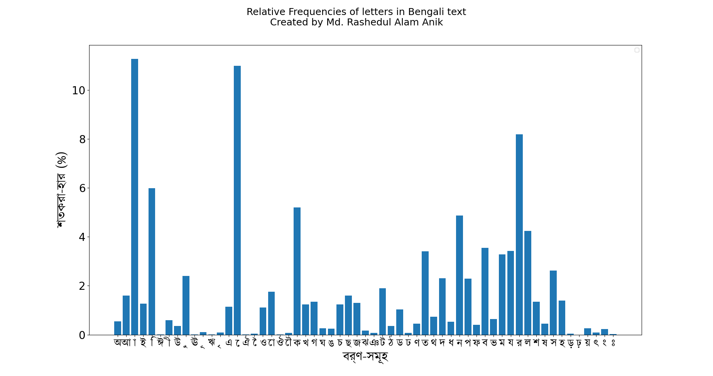

# Bangla Frequency Calculator

This is a python script that is used to count and show the frequency of bangla words from random large bangla input file, that shows the relative frequency of Bangla words in inputs.

## Calculated Character Frequency Chart

